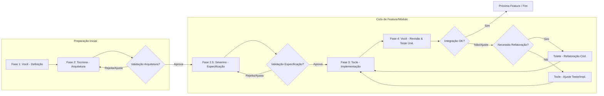

# Método AGV: Fluxo de Trabalho v1.0

Este documento descreve o fluxo de trabalho passo a passo para desenvolver software usando o Método AGV (Assistência Generativa à Velocidade), que alavanca LLMs como assistentes especializados (agentes) em diferentes fases do desenvolvimento, sob a coordenação humana.

## Visão Geral do Fluxo

O fluxo principal segue estas fases, com coordenação e validação humana em pontos chave:

*Diagrama simplificado. A integração e os testes de integração são tratados incrementalmente.*

## Papéis dos Agentes (Versão Inicial)

*   **Você:** Idealizador, Definidor de Requisitos, Coordenador, Validador Crítico, Tomador de Decisões Finais.
*   **Tocrisna (Arquiteta):** Define a estrutura técnica, componentes, interfaces e padrões. Usa `Prompts/Templates/Prompt_Tocrisna_Architecture_v1.0.md`.
*   **Severino (Especificador):** Traduz requisitos de alto nível em especificações técnicas detalhadas para um módulo/feature, usando o contexto da arquitetura. Usa `Prompts/Templates/Prompt_Severino_EspeciFi_v1.0.md`.
*   **Tocle (Engenheiro):** Implementa o código funcional e os testes unitários, seguindo a arquitetura e a especificação. Também atualiza/refatora testes. Usa `Prompts/Templates/Prompt_Tocle_Implementation_v1.0.md` e `Prompts/Templates/Prompt_Tocle_RefatorTest_v1.0.md`.
*   **Tolete (Refatorador):** Melhora a qualidade do código de produção existente, sem alterar a funcionalidade. Usa `Prompts/Templates/Prompt_Tolete_Refatoracao_v1.0.md`.

## Fases Detalhadas

**Fase 1: Definição e Preparação (Você)**

*   **Objetivo:** Estabelecer a visão, escopo inicial, e restrições técnicas do projeto.
*   **Inputs:** Ideia inicial, pesquisa de mercado/necessidade (se aplicável).
*   **Atividades:**
    1.  Definir o nome e objetivo geral do projeto.
    2.  Listar as funcionalidades chave em alto nível.
    3.  Pesquisar e decidir sobre a Stack Tecnológica principal (linguagem, frameworks, libs essenciais, BD).
    4.  Identificar requisitos não funcionais importantes (performance, segurança básica) e restrições.
    5.  Organizar essas informações.
*   **Output:** Documento de Visão e Definição Inicial (contendo todos os pontos acima).
*   **Validação:** Auto-revisão para clareza e completude.

**Fase 2: Arquitetura Técnica (Tocrisna)**

*   **Objetivo:** Criar o blueprint técnico do sistema.
*   **Inputs:** Documento de Visão e Definição Inicial (da Fase 1).
*   **Atividades:**
    1.  Preparar o `Prompts/Templates/Prompt_Tocrisna_Architecture_v1.0.md` preenchendo a seção "Contexto e Definições Iniciais".
    2.  Executar o prompt com a LLM escolhida.
    3.  Analisar criticamente o Blueprint Arquitetural gerado pela IA.
*   **Output:** Blueprint Arquitetural Detalhado (incluindo visão geral, componentes, interfaces, estrutura de diretórios, etc.).
*   **Validação (Você): CRÍTICA.** Revisar o blueprint. Faz sentido? Os componentes estão lógicos? As interfaces estão claras? A tecnologia está adequada? A estrutura parece organizada? **Iterar com Tocrisna (refazer o prompt com ajustes) se necessário até aprovar.**

**Fase 2.5: Especificação Funcional Detalhada (Severino)**

*   **Objetivo:** Detalhar *uma* funcionalidade ou módulo específico para implementação.
*   **Inputs:**
    *   Descrição de alto nível da funcionalidade desejada (por Você).
    *   Blueprint Arquitetural Aprovado (da Fase 2 - especificamente as partes relevantes para esta funcionalidade).
*   **Atividades:**
    1.  Preparar o `Prompts/Templates/Prompt_Severino_EspeciFi_v1.0.md` preenchendo a descrição de alto nível e as seções relevantes do contexto arquitetural.
    2.  Executar o prompt com a LLM.
    3.  Analisar a Especificação Técnica Detalhada gerada pela IA.
*   **Output:** Bloco de texto contendo a Especificação Técnica Detalhada (inputs, processamento, outputs, erros, regras) para *aquela* funcionalidade.
*   **Validação (Você): IMPORTANTE.** Revisar a especificação. Ela captura sua intenção funcional? O fluxo descrito faz sentido? O tratamento de erro parece razoável? **Iterar com Severino se necessário.**

**Fase 3: Implementação e Teste Unitário (Tocle)**

*   **Objetivo:** Escrever o código funcional e os testes unitários para a funcionalidade especificada.
*   **Inputs:**
    *   `Prompts/Templates/Prompt_Tocle_Implementation_v1.0.md` preenchido com:
        *   Contexto Arquitetural relevante (da Fase 2).
        *   Especificação Técnica Detalhada (da Fase 2.5).
        *   Stack tecnológica e framework de teste definidos.
*   **Atividades:**
    1.  Executar o prompt com a LLM/ferramenta (Cursor, etc.).
    2.  Analisar o código de produção e o código de teste gerados.
*   **Output:**
    *   Arquivo `.py` com o código da funcionalidade.
    *   Arquivo `test_*.py` com os testes unitários (usando mocks).
*   **Validação (Você):** Ver Fase 4.

**Fase 4: Revisão, Integração e Testes (Você + IA)**

*   **Objetivo:** Garantir que o código gerado é de qualidade, funciona isoladamente e se integra corretamente (incrementalmente).
*   **Inputs:** Código de produção e testes gerados na Fase 3.
*   **Atividades (Ciclo Iterativo):**
    1.  **Revisão de Código (Você):** Ler o código gerado. Parece claro? Segue as diretrizes? A lógica parece correta?
    2.  **Execução de Testes Unitários (Você/Ambiente):** Rodar os testes gerados. Todos passam? Eles testam o que deveriam?
    3.  **Refatoração (Opcional - Tolete):** Se o código funciona mas pode ser melhorado (clareza, DRY, etc.), usar o `Prompts/Templates/Prompt_Tolete_Refatoracao_v1.0.md`. *Após refatorar, voltar ao Passo 2 (rodar testes).*
    4.  **Ajuste de Testes (Opcional - Tocle):** Se os testes unitários precisam ser melhorados ou atualizados após refatoração do código de produção, usar o `Prompts/Templates/Prompt_Tocle_RefatorTest_v1.0.md`. *Após ajustar, voltar ao Passo 2.*
    5.  **Teste de Integração (Você/Ambiente):** **CRUCIAL (Incremental):** Se esta funcionalidade interage com outras já existentes, executar testes que verifiquem essa interação (podem ser manuais inicialmente ou automatizados com ajuda da IA/prompt específico se necessário).
    6.  **Commit (Você):** Se tudo estiver OK, versionar o código funcional e os testes no Git.
*   **Output:** Código validado e integrado da funcionalidade. Base de código atualizada.
*   **Validação (Você):** O código faz o que deveria? Os testes passam? A integração com outras partes funciona? **Só então seguir para a próxima feature/módulo (voltando à Fase 2.5 ou 3).**

**Fase 5: Ciclo de Vida (Manutenção e Evolução)**

*   Para **novas features:** Retornar à Fase 2.5 ou 3.
*   Para **corrigir bugs:** Analisar o bug, usar Tocle (com prompt de implementação ou teste) ou Tolete para corrigir e garantir que os testes cubram o bug.
*   Para **refatorar código existente:** Usar Tolete.
*   Para **atualizar testes:** Usar Tocle com o prompt de teste.

## Princípios Chave

*   **Coordenação Humana:** Você está no comando, definindo, validando e tomando decisões.
*   **Validação Contínua:** Valide os outputs de cada fase antes de prosseguir.
*   **Iteração:** Não espere perfeição na primeira tentativa da IA. Use os prompts, revise, ajuste o prompt ou peça correções.
*   **Gerenciamento de Contexto:** Forneça apenas o contexto necessário para cada prompt. Use resumos ou documentos externos para estado de longo prazo.
*   **Foco na Qualidade:** Mantenha as diretrizes de alta qualidade (clareza, testes, etc.) em todas as fases.

## Princípios de Engenharia de Software

O Método AGV é guiado por princípios de engenharia de software que visam maximizar a qualidade, manutenibilidade e eficiência da colaboração humano-IA. Os detalhes desses princípios estão documentados em [`AGV_Method_Principios_Chave.md`](./AGV_Method_Principios_Chave.md). Os mais importantes incluem:

*   **Integração Incremental via Interfaces Explícitas:** Define como os módulos são projetados para interagir de forma robusta e desacoplada (Ver detalhes no documento de princípios).
*   **Validação Humana Contínua:** Ênfase na revisão e aprovação humana em etapas críticas (Arquitetura, Especificação, Código/Testes).
*   **Foco na Qualidade:** Aplicação consistente de boas práticas (PEP 8, SRP, DRY, KISS, Type Hints, Docstrings, Testes).
*   **Gerenciamento de Contexto da IA:** Uso de prompts focados e contexto mínimo necessário.
*   **Iteração:** Reconhecimento de que o desenvolvimento é iterativo e ajustes nos prompts ou no código podem ser necessários.