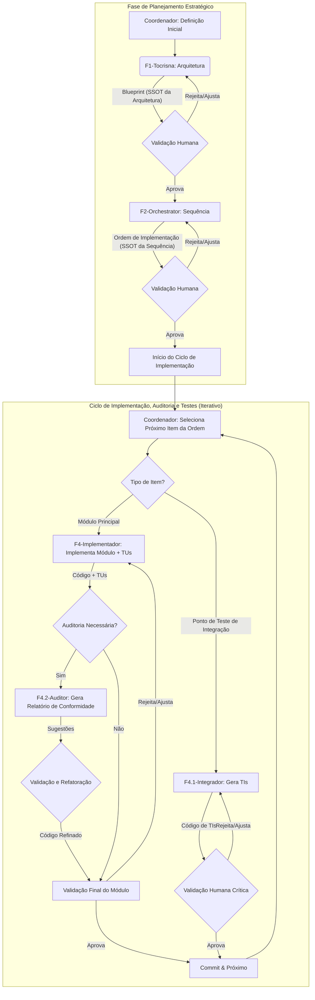

# Método AGV: Fluxo de Trabalho v4.0 (Lean & Strategic)

Este documento descreve o fluxo de trabalho passo a passo para desenvolver software usando o Método AGV v4.0, consolidado após a validação bem-sucedida da abordagem "Lean & Strategic" no projeto piloto Fotix.

## Visão Geral do Fluxo (v4.0)

O fluxo v4.0 é centrado na **Direção Estratégica** e na **Fonte Única da Verdade (SSOT)**. O Coordenador define o "quê", e a IA, guiada por prompts enxutos, determina o "como", consultando os artefatos corretos para cada tipo de informação.



## Papéis dos Agentes (v4.0)

-   **Coordenador (Humano):** Estrategista, Arquiteto-chefe, Revisor Crítico, e Auditor. Define a visão, a stack, valida os artefatos e decide quando executar auditorias de conformidade.
-   **F1 - Tocrisna (IA - Arquiteta):** Gera o **Blueprint Arquitetural**, a fonte única da verdade para a estrutura do projeto.
    *   **Prompt Associado:** `Prompt_F1_Tocrisna_Architecture_v1.9.md`
-   **F2 - OrchestratorHelper (IA - Planejadora Lean):** Gera a **Ordem de Implementação**, a fonte única da verdade para a sequência de trabalho.
    *   **Prompt Associado:** `Prompt_F2_Orchestrator_v2.0_lean.md`
-   **F4 - ImplementadorMestre (IA - Engenheira de Implementação Lean):** Implementa um componente e seus Testes Unitários (TUs) obrigatórios, consultando o Blueprint para detalhes de design.
    *   **Prompt Associado:** `Prompt_F4_Implementador_Mestre_v4.0_lean.md`
-   **F4.1 - IntegradorTester (IA - Engenheira de TIs):** Gera Testes de Integração (TIs) para validar a colaboração entre subsistemas.
    *   **Prompt Associado:** `Prompt_F4.1_Implementador_TesteDeIntegracao_v1.0.md`
-   **F4.2 - AuditorDeConformidade (IA - Auditora de Código Sênior):** (Opcional) Realiza uma análise aprofundada de um componente em relação à documentação de uma biblioteca externa para garantir conformidade e otimização.
    *   **Prompt Associado:** `Prompt_F4.2_Auditor_Conformidade_v1.0.md` (a ser formalizado)

## Fases Detalhadas (v4.0)

### Fase 1: Definição Inicial (Coordenador)

-   **Objetivo:** Estabelecer a visão, escopo e stack tecnológica do projeto.
-   **Output:** Documento de Visão e Definição Inicial.

### Fase 2: Arquitetura Técnica (F1 - Tocrisna)

-   **Objetivo:** Criar o mapa mestre do sistema.
-   **Atividades:**
    1.  Coordenador prepara e executa o `Prompt_F1_Tocrisna_Architecture`.
    2.  A IA (Tocrisna) gera o `Output_BluePrint_Arquitetural.md`.
-   **Output:** **Blueprint Arquitetural.** Este arquivo é a **SSOT para toda a estrutura, componentes, responsabilidades e dependências.**
-   **Validação (Coordenador): CRÍTICA.** O Coordenador valida a lógica e a completude do Blueprint.

### Fase 2.1: Planejamento da Sequência (F2 - OrchestratorHelper)

-   **Objetivo:** Criar a lista de tarefas do projeto.
-   **Input:** O Blueprint Arquitetural validado.
-   **Atividades:**
    1.  Coordenador prepara e executa o `Prompt_F2_Orchestrator_v2.0_lean` com o Blueprint como contexto.
    2.  A IA (OrchestratorHelper) analisa as dependências no Blueprint e gera a ordem de implementação.
-   **Output:** **Ordem de Implementação.** Este arquivo é a **SSOT para a sequência de trabalho**, contendo apenas a lista de alvos e as paradas para testes de integração.
-   **Validação (Coordenador): IMPORTANTE.** O Coordenador valida se a sequência faz sentido lógico.

**--- INÍCIO DO CICLO DE IMPLEMENTAÇÃO E VALIDAÇÃO ---**

*(O Coordenador segue a Ordem de Implementação sequencialmente)*

### Fase 3.1: Implementação de Módulo e Testes Unitários (F4 - ImplementadorMestre)

-   **Objetivo:** Implementar um componente funcional e testado unitariamente.
-   **Inputs (para o `Prompt_F4_Implementador_Mestre_v4.0_lean`):**
    *   **Componente Alvo Principal:** (Nome do item da Ordem de Implementação).
    *   `@Blueprint_Arquitetural.md` (Para a IA consultar os detalhes de design).
    *   `@Ordem_De_Implementacao.md` (Apenas para contexto de sequência, opcional).
    *   `@Contexto Adicional do Workspace`: Código de dependências já implementadas.
-   **Atividades:**
    1.  Coordenador prepara e executa o prompt.
    2.  A IA (ImplementadorMestre) lê o prompt, identifica seu alvo, e então **consulta o Blueprint** para entender as responsabilidades, interfaces e dependências necessárias para construir o componente e seus TUs.
-   **Output:** Código-fonte do componente e seus testes unitários.

### Fase 3.2: Validação, Auditoria e Refinamento (Coordenador + F4.2)

-   **Objetivo:** Garantir que o código não é apenas funcional, mas também de alta qualidade, otimizado e em conformidade com as melhores práticas.
-   **Atividades:**
    1.  **Validação do Coordenador:** O Coordenador revisa o código e executa os testes. Para muitos componentes internos, este passo pode ser suficiente.
    2.  **(Opcional) Auditoria de Conformidade:** Se o componente faz uso pesado de uma biblioteca externa complexa (`stream-unzip`, `PySide6`, etc.), o Coordenador pode invocar o `AuditorDeConformidade (F4.2)`.
        *   **Input:** Código do componente + Documentação oficial da biblioteca.
        *   **Output:** Relatório de auditoria com sugestões de refatoração.
    3.  **Ciclo de Refinamento:** O Coordenador guia o `ImplementadorMestre` para aplicar as refatorações sugeridas pela auditoria até que o componente atinja o padrão de qualidade desejado.
-   **Validação (Coordenador): CRÍTICA.** O Coordenador dá a aprovação final ao módulo.

### Fase 3.3: Geração de Testes de Integração (F4.1 - IntegradorTester)

-   **Objetivo:** Validar que um subsistema (conjunto de módulos) funciona corretamente em conjunto.
-   **Gatilho:** Ao atingir uma "PARADA PARA TESTES DE INTEGRAÇÃO" na Ordem de Implementação.
-   **Atividades:**
    1.  Coordenador prepara e executa o `Prompt_F4.1_Implementador_TesteDeIntegracao`.
    2.  A IA (IntegradorTester) gera os testes de integração.
-   **Output:** Código-fonte dos testes de integração.
-   **Validação (Coordenador): CRÍTICA.** O Coordenador executa e valida a lógica dos TIs.

### Fase 3.4: Commit e Próximo Item

-   Após a validação bem-sucedida, o Coordenador versiona o código.
-   O Coordenador seleciona o próximo item da Ordem de Implementação e retorna ao início do ciclo (Fase 3.1).

**--- FIM DO CICLO DE IMPLEMENTAÇÃO ---**

### Fase 4: Revisão Final e Conclusão

-   **Objetivo:** Realizar uma verificação holística do sistema completo.
-   **Atividades:** Executar toda a suíte de testes (TUs e TIs), realizar testes manuais (se aplicável), preparar a documentação final do projeto.

### Fase 5: Ciclo de Vida (Manutenção e Evolução)

-   O método pode ser reaplicado para adicionar novas funcionalidades ou corrigir bugs, reiniciando o ciclo na fase apropriada (ex: Fase 2 se houver impacto na arquitetura, ou diretamente na Fase 3 para pequenas adições).
```